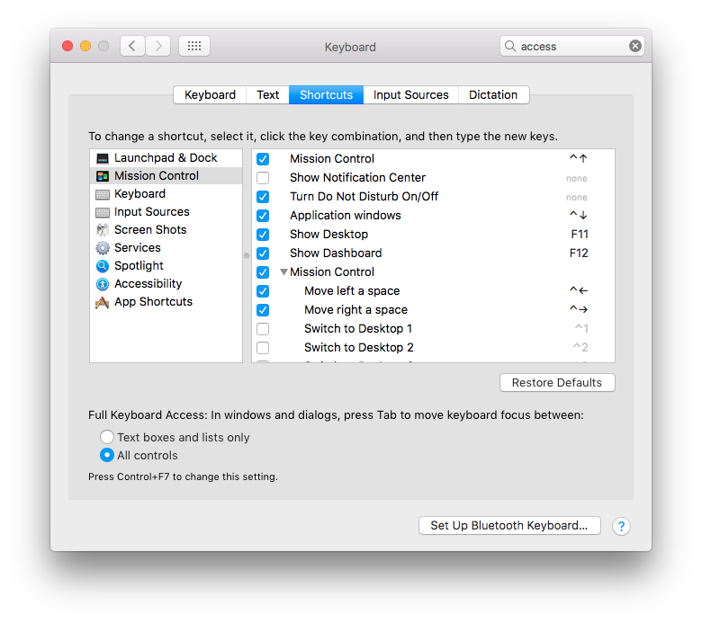
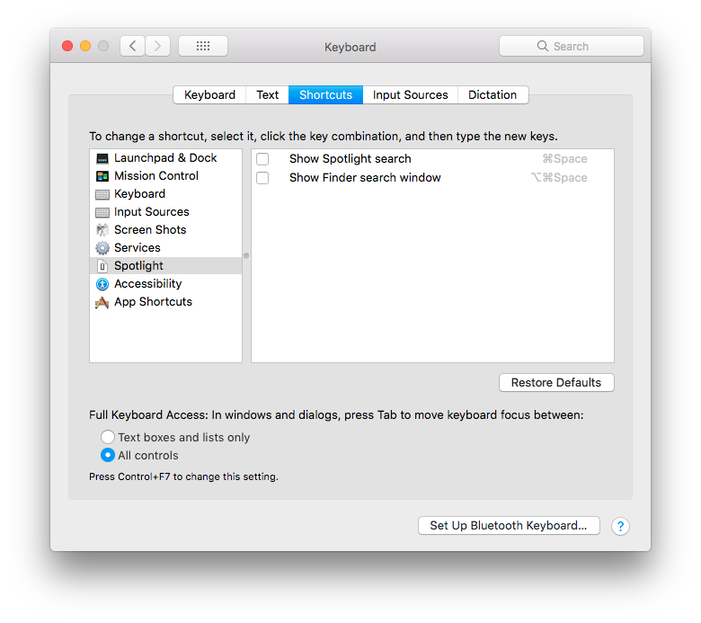
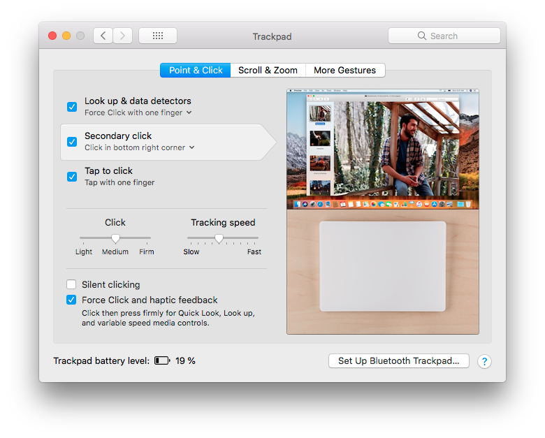
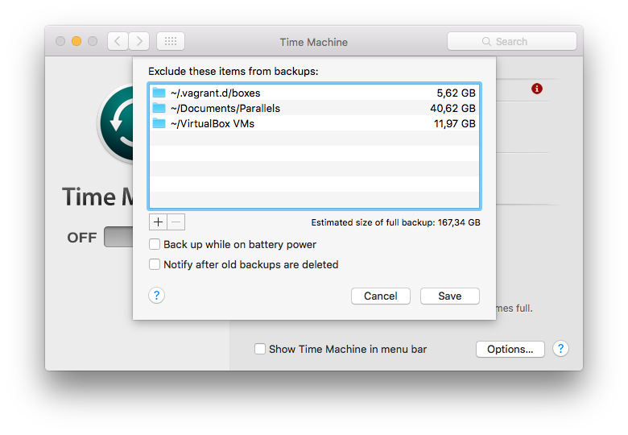
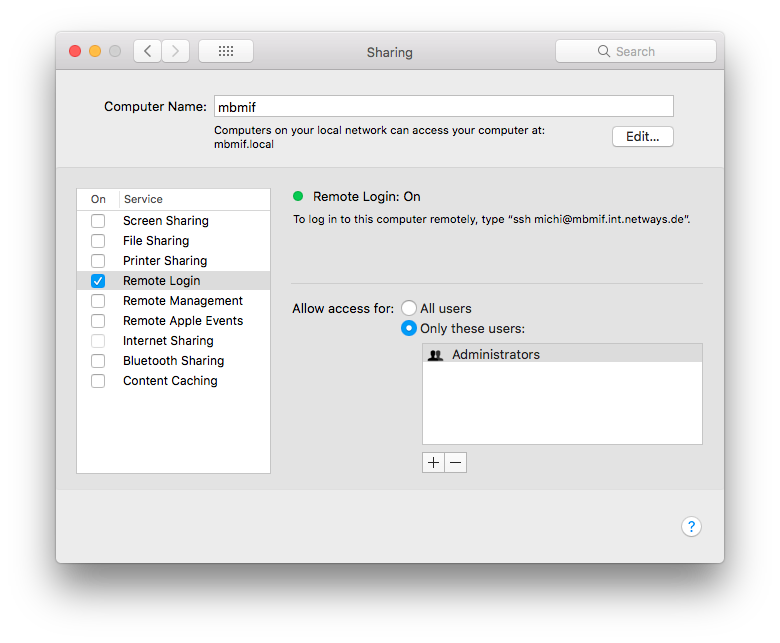
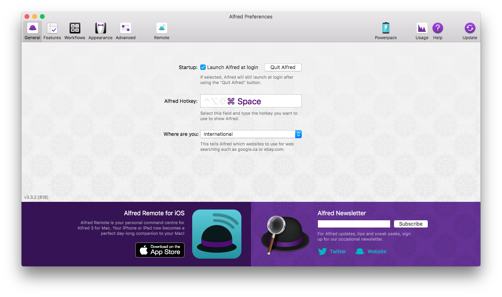

# Macbook Pro for Development

In addition to the files stored in this repository, the following
instructions are needed to fully setup a Macbook Pro.

It contains specialities for NETWAYS & Icinga development.

## Preparations

### iterm2

Install it manually from the website first.

* Terminal: [iterm2](https://www.iterm2.com/)

### Homebrew

Install it once.

```
/usr/bin/ruby -e "$(curl -fsSL https://raw.githubusercontent.com/Homebrew/install/master/install)"
```

### Sudo

```
sudo visudo

michi  ALL=(ALL) NOPASSWD: ALL
```

### Backup

Copy the following files in your home directory:

* SSH Keys
* GPG Keys
* GitHub Tokens
* SSH Aliases
* Pypi Credentials

```
cd backup/
cp -r .ssh .gnupg .github_tokens .bash_aliases .pypirc  $HOME/
```

### Dot files

```
git clone https://github.com/dnsmichi/dotfiles.git
cd dotfiles
./bootstrap.sh
./.macos
./brew.sh
```

Depending on local development, you may want to install the tools and configuration
too:

```
./icinga2.sh
./icingaweb2.sh
```

## Essentials

### Tools

These tools are managed without Homebrew on purpose, e.g. for manual updates.

* Terminal: [iterm2](https://www.iterm2.com/)
* Workflows: [Alfred 3](https://www.alfredapp.com/)

#### Network

* Cisco AnyConnect Secure Mobility Client
* [Viscosity VPN](https://www.sparklabs.com/viscosity/)

Import any downloaded ovpn file.

#### Virtualization

* [Parallels Pro](https://www.parallels.com/de/products/business/download/) - License required
* [VirtualBox](https://www.virtualbox.org/wiki/Downloads)

Move the VM directory into `$HOME` instead of `Documents` which belong to iCloud.


## System Preferences

### Keyboard

`Keyboard`: Enable tab-tab for everything.



`Shortcuts`: Disable Spotlight.



### Trackpad

`Point & Click > Secondary click` and select `Click in bottom right corner`.



### Security & Privacy

- Turn on Filevault and encrypt everything, if not done during the setup
- Turn on the firewall

### Time Machine

`Select Backup Disk` - `Encrypt backups`
Connect with the given credentials (see wiki) and then also exclude specific directories from backup, e.g. VMs.



### Sharing

Allow remote login via SSH for admins.



## User Preferences

### iterm2

`Preferences > Load preferences from a custom folder or URL`: `~/.dotfiles/iterm2`
Quit iterm2 entirely and start it again.

### Alfred 3

Powerpack requires a license.

Start Alfred from the Applications folder, and change the hotkey to `Cmd+Space`.
Ensure that Spotlight is disabled in the system preferences.



### Finder

`Preferences > Sidebar` and add

- User home
- System root

### Mail

`Preferences > General`:

- `New messages sound`: None
- `Play sounds for other mail actions`: unticked

`Preferences > Viewing`:

- `Show most recent message at the top`: ticked

### Chat

- Jitsi: Add SIP details
- Adium: Ensure to use 1.5.10.2, because that works with Alfred workflows. Revision 4 doesn't.


## Additional Applications

* CleanMyMac 3 (license required)
* Docker (account required)
* Enpass (account required)
* FileZilla
* GitKraken (account required)
* Google Chrome
* HandBrake
* JetBrains Toolbox (license required)
* Microsoft Office (license required)
* Nextcloud (account required)
* NTFS for Mac (license required)
* Parallels Desktop (license required)
* Paw (license required)
* Sourcetree (account required)
* Spotify (account required)
* TeamViewer
* Telegram (account required)
* Virtualbox
* Viscosity (license required)
* Wunderlist (account required)

Homebrew

* Apache Directory Studio
* Atom
* Boxer
* Firefox
* JDownloader2
* MacVim
* Poedit
* VLC
* Wireshark

## Migration <a id="migration"></a>


### Keys

Keep a private backup of the following:

```
cd $HOME
zip -r private_keys.zip .ssh .gnupg .github_tokens certs .my.cnf
zip -r jitsi.zip Library/Application\ Support/Jitsi/
zip -r adium.zip Library/Application\ Support/Adium\ 2.0/
zip -r viscosity.zip Library/Application\ Support/Viscosity/
```

And copy them over first.

### Data

* My documents are synced via iCloud (if yours are not, copy them too)
* Move the development data from `~/coding` to their new location in `~/dev`-
* Copy `~/Downloads`, `~/Pictures`, `~/go`

Rsync/SSH requires enabled remote login for this purpose.

```
ssh-copy-id michi@mbpmif.int.netways.de

cd $HOME/coding
rsync -rv . michi@mbpmif.int.netways.de:/Users/michi/dev/

cd $HOME/Downloads
rsync -rv . michi@mbpmif.int.netways.de:/Users/michi/Downloads/

cd $HOME/Pictures
rsync -rv . michi@mbpmif.int.netways.de:/Users/michi/Pictures/

cd $HOME
rsync -rv go michi@mbpmif.int.netways.de:/Users/michi/
```

In addition, I do have a Dosbox with my Settlers 2 Gold Edition which needs to be copied too :)

```
cd $HOME/
rsync -rv "DOS Games" michi@mbpmif.int.netways.de:/Users/michi/
```

