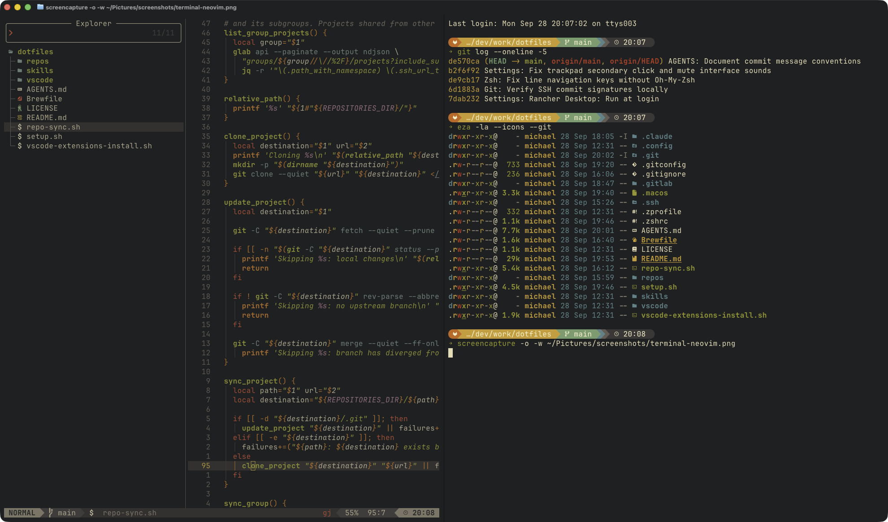

# Macbook Pro dotfiles and setup at work (GitLab)

1. **Focus**: Developer Advocacy with agentic AI, engineering, docs, tutorials and recordings.
1. **Software**: New and old productivity tools, AI agents, and frameworks, e.g. Ghostty, Starship, neovim, Mise, etc.
1. **Hardware**: Macbook Pro 14", M4 Max, 64 GB RAM, 1 TB (performance model).
1. **Remote office**: The Macbook is connected to @dnsmichi's remote office setup
with CalDigit TS5 Plus, Magic Keyboard, Apple Trackpad, Samsung Odyssey 49",
Razer soundbar, and more, described in the [all-remote workspace setup](https://dnsmichi.com/all-remote-workspace/).
1. **Security:** No credentials and keys in .env, .gitconfig, or other config files.

This is an opinionated setup, optimized for efficiency and productivity. Fork it and modify it for your own needs.



<details><summary>Archive:</summary>

- 2026-09: The setup with Oh-My-ZSH and Powerlevel10k on the previous M1 model is documented in [this blog post](https://dnsmichi.at/2022/03/11/new-zsh-theme-on-macos-powerlevel10k/) at [this commit](https://gitlab.com/dnsmichi/dotfiles/-/tree/701851b5cb36dc3fc2796e2e0f7fa3038fbd611a)
- 2023-05: The setup for the previous 16", 2019 Intel model can be found [at this commit](https://gitlab.com/dnsmichi/dotfiles/-/tree/4bd8993aad5e798fff3e67365f81407bb65e5b87). The setup is explained in-depth in [dotfiles - Document and automate your Macbook setup](https://about.gitlab.com/blog/2020/04/17/dotfiles-document-and-automate-your-macbook-setup/).

</details>

---

## What's inside

A quick overview to pick what is interesting for your own setup. Each area links to its details.

- **One switch for light and dark**: Ghostty, Starship, Neovim, and VS Code all follow
  the macOS appearance setting with matching themes. Switching macOS between light
  and dark mode switches every tool at once, which keeps maintenance simple and
  makes demos and screenshots easy to control.
- **One setup script**: [setup.sh](#run-setupsh) installs Homebrew and the Brewfile
  packages, and links the tracked configuration into your home folder, so edits
  land in this repository. Rerun it any time to update packages and restore links;
  it never overwrites local changes, and shows a diff instead.
- **Terminal**: [Ghostty](#terminal-and-shell) with tmux, and plain Zsh with a few
  small configuration files instead of a framework. The Starship prompt, Atuin shell
  history, and zoxide keep it keyboard-driven and fast.
- **Editors**: [Neovim with LazyVim](#neovim-with-lazyvim) for the terminal, and
  [VS Code](#vs-code) with a tracked extension list.
- **Credentials**: [1Password](#1password-ssh-agent-and-cli) for SSH keys, commit
  signing, and API keys, so no secrets live on disk.
- **GitLab workflow**: the GitLab CLI and [repo-sync.sh](#gitlab-cli-and-repositories),
  which clones your groups and projects in one go.
- **Agentic AI**: [GitLab Duo, Claude, and Glean](#agentic-ai). Shared agent skills are
  linked into each tool, and [AGENTS.md](AGENTS.md) documents this repository's rules
  for coding agents.
- **Languages and tools**: [mise](#install-languages-with-mise) for Node.js, Python,
  Ruby, Go, and Rust, and Homebrew for everything else in the [Brewfile](Brewfile).
- **macOS**: [opt-in preferences](#macos-preferences-for-efficiency) for keyboard,
  trackpad, Finder, and screenshots.

## Setup checklist

Follow the steps top down on a new Macbook. Each step builds on the previous one.
To track progress, [create an issue from the `new-macbook-setup` template](https://gitlab.com/dnsmichi/dotfiles/-/issues/new?issuable_template=new-macbook-setup),
which lists every step and sub-section as a tickable checklist.

1. [Base system](#base-system)
   1. [Endpoint management and apps](#endpoint-management-and-apps)
   1. [Command Line Tools](#command-line-tools)
   1. [Clone this repository](#clone-this-repository)
   1. [Install mise](#install-mise)
   1. [Run setup.sh](#run-setupsh)
   1. [Install languages with mise](#install-languages-with-mise)
1. [Credentials and GitLab](#credentials-and-gitlab)
   1. [1Password SSH agent and CLI](#1password-ssh-agent-and-cli)
   1. [GitLab CLI and repositories](#gitlab-cli-and-repositories)
1. [Agentic AI](#agentic-ai)
   1. [GitLab Duo Agent Platform](#gitlab-duo-agent-platform)
   1. [GitLab Duo CLI](#gitlab-duo-cli)
   1. [Claude](#claude)
   1. [Glean](#glean)
   1. [Other agentic AI tools for integration guides](#other-agentic-ai-tools-for-integration-guides)
1. [Personal settings](#personal-settings)
   1. [macOS preferences for efficiency](#macos-preferences-for-efficiency)
   1. [App settings](#app-settings)
   1. [Bring back shell history and AI settings](#bring-back-shell-history-and-ai-settings)

## Setup

Step-by-step instructions for a new Macbook, grouped into four phases. Each phase
builds on the previous one, from a fresh macOS install to a fully configured workstation.

### Base system

Install the apps, compilers, and package managers, then link the tracked
configuration from this repository into the home directory.

#### Endpoint management and apps

The GitLab work environment uses endpoint management for Macbooks. Follow the [laptop management instructions](https://handbook.gitlab.com/handbook/eta/corporate-it/end-user-services/laptop-management/) to set up Okta, FileVault encryption, security profiles, and required packages (1Password, Chrome, Zoom, etc.) automatically.

Install the remaining apps manually. Their configuration is linked by `setup.sh` in a later step.

| Type            | Tools |
|-----------------|-------|
| Credentials     | [1Password](https://1password.com/product/mac/), [1Password for Safari/Chrome](https://apps.apple.com/us/app/1password-for-safari/id1569813296?) |
| Terminal        | [Ghostty](https://ghostty.org/download): enable automatic updates when asked |
| Editor          | [VS Code](https://code.visualstudio.com/download): its own updater controls the release cycle. [JetBrains IDE Toolbox](https://www.jetbrains.com/toolbox-app/) ([license required](https://handbook.gitlab.com/handbook/tools-and-tips/editors-and-ides/jetbrains-ides/licenses/) for IntelliJ IDEA, PyCharm, GoLand, RubyMine, CLion, RustRover, Rider, DataGrip, etc.) |
| Backup          | [Google Drive for Desktop](https://support.google.com/a/users/answer/13022292#drive_desktop_install) |
| Containers      | [Rancher Desktop](https://rancherdesktop.io/) |
| Browser         | [Google Chrome](https://www.google.com/chrome/), Safari |
| DevRel          | [Adobe Creative Cloud](https://www.adobe.com/apps/all/all-platforms/pdp/creative-cloud?source=apps) (Premiere Pro, etc.) - enterprise license, [Screen Studio](https://screen.studio/download) (approved license) - [handbook](https://handbook.gitlab.com/handbook/marketing/product-and-technical-marketing/developer-advocacy/content/#recording-with-screen-studio) |

Agentic AI tools are set up in [Agentic AI](#agentic-ai).

#### Command Line Tools

Install Git, compilers, and the macOS SDK with the Xcode Command Line Tools.
Open Ghostty and run:

```shell
xcode-select --install
```

The Command Line Tools are enough for all compilers used here, including
Neovim's treesitter parsers. Full Xcode is not needed: it requires an Apple
account login, which the GitLab-managed profile does not use.

#### Clone this repository

Clone this repository over HTTPS. SSH works only after the 1Password SSH agent is
set up in [1Password SSH agent and CLI](#1password-ssh-agent-and-cli).

```shell
mkdir -p ~/dev/work
cd ~/dev/work

git clone https://gitlab.com/dnsmichi/dotfiles.git
cd dotfiles
```

#### Install mise

Languages and frameworks are managed with [mise](https://mise.jdx.dev/getting-started.html),
for example, Node.js, Ruby, Python, etc. Install it before running `setup.sh`,
because the linked `.zshrc` activates mise in every new shell.

```shell
curl https://mise.run | sh
~/.local/bin/mise --version
```

#### Run setup.sh

```shell
./setup.sh
```

The script:

1. Checks for the Xcode Command Line Tools.
1. Installs [Homebrew](https://brew.sh/) when it is missing.
1. Installs and updates the packages in [Brewfile](Brewfile).
1. Links the tracked configuration into the home directory `~`, with the same
   paths as in this repository, e.g. `.config/starship.toml`.
1. Links each agentic skill under [skills/](skills/) into `~/.claude/skills/`,
   `~/.agents/skills/`, and `~/.gitlab/duo/skills/` for Claude Code, Codex, and
   GitLab Duo.

`setup.sh` is safe to rerun. It does not modify macOS defaults. If a link has
been replaced with a regular file, the script stops and shows a recursive diff
instead of overwriting local changes. Merge any wanted changes into this
repository, remove the local file, and rerun the script.

Open a new Ghostty window afterwards, so the linked shell configuration is loaded.

#### Install languages with mise

Globally installed languages are configured in [.config/mise/config.toml](.config/mise/config.toml).
Navigate into this repository and run:

```shell
mise install
```

### Credentials and GitLab

Connect 1Password for SSH keys, commit signing, and secrets, then authenticate
with GitLab.com and clone the repositories used for work.

#### 1Password SSH agent and CLI

Store private SSH keys in 1Password only, and never on disk.

Open 1Password `Settings > Developer`:

1. Tick `Use the SSH Agent`.
1. Select `Show title` for SSH keys, and `Open SSH URLs with Ghostty`.
1. In `Developer Integrations`, tick `Integrate with 1Password CLI`. The
   1Password CLI `op` is installed by the Brewfile, and unlocks with Touch ID.

`setup.sh` already linked the matching configuration:

- [.ssh/config](.ssh/config) uses the 1Password SSH agent and selects the public
  key [.ssh/gitlab_work.pub](.ssh/gitlab_work.pub) for gitlab.com. 1Password
  provides the private key.
- [.gitconfig](.gitconfig) signs commits with the same key through 1Password.

To retrieve other secrets on the terminal, see [Retrieve secrets with 1Password CLI](#retrieve-secrets-with-1password-cli).

##### Switch this repository to SSH

Switch the remote from HTTPS to SSH, then test the SSH key and commit signing:

```shell
git remote set-url origin git@gitlab.com:dnsmichi/dotfiles.git

ssh -T git@gitlab.com
git commit --allow-empty -m "Test commit signing" && git log --show-signature -1
```

Remove the empty test commit with `git reset --soft HEAD~1` when it is not needed.

#### GitLab CLI and repositories

The GitLab CLI `glab` is installed by the [Brewfile](Brewfile). Authenticate against GitLab.com:

```shell
glab auth login --hostname gitlab.com --git-protocol ssh
```

Select `Web` and follow the OAuth browser popup to approve.

Then clone the GitLab groups and projects:

```shell
./repo-sync.sh
```

[repo-sync.sh](repo-sync.sh) clones repositories into
`~/dev/work/<group>/<subgroup>/<project>`, based on two inventories:

- [repos/groups.txt](repos/groups.txt): groups cloned recursively,
  including subgroups. Archived projects and projects shared from other groups are skipped.
- [repos/projects.txt](repos/projects.txt): individually selected projects.

For fast typing, the script also links `~/dev/da` to `~/dev/work/gitlab-da`
for Developer Advocacy work. Shortcuts are listed in `SHORTCUTS` at the top
of the script; existing folders or other links at that path are reported, never replaced.

The script is safe to rerun. Existing clones are fetched and fast-forwarded when
their working tree is clean; repositories with local changes or diverged branches
are reported and left alone. Set `REPOSITORIES_DIR` to clone somewhere else.

Private projects whose paths are already publicly known can stay in the tracked
lists. Keep other private or confidential paths in `repos/groups.local.txt` and
`repos/projects.local.txt`, which use the same format and are not tracked.

### Agentic AI

Agentic AI tools for daily work, demos, and integration guides.
`setup.sh` already linked the agentic skills from [skills/](skills/) for all tools below.

#### GitLab Duo Agent Platform

Provisioned access as team member, and Developer Advocate in [gitlab.com/gitlab-da](https://gitlab.com/gitlab-da).
See the [GitLab Duo Agent Platform docs](https://docs.gitlab.com/user/duo_agent_platform/).

#### GitLab Duo CLI

Included in `glab`. The [ZSH alias](.config/zsh/aliases.zsh) `duo` runs `glab duo cli`.
See [GitLab Duo CLI in the Dev Advocacy Handbook](https://handbook.gitlab.com/handbook/marketing/product-and-technical-marketing/developer-advocacy/dev-environments/#gitlab-duo-cli).

#### Claude

Follow the [Developer Advocacy handbook](https://handbook.gitlab.com/handbook/marketing/product-and-technical-marketing/developer-advocacy/dev-environments/#claude-code),
and the [Claude handbook page](https://handbook.gitlab.com/handbook/tools-and-tips/ai/claude/) for Claude Desktop.

```shell
curl -fsSL https://claude.ai/install.sh | bash
```

Run `claude` and set the following:

1. Theme / text style: `Auto` to follow Ghostty and Starship defaults.
1. Login method: Account with subscription. Follow the OAuth login popup.

#### Glean

Follow the [handbook](https://handbook.gitlab.com/handbook/eta/ai/tools/glean/) for access and setup.
Install the [Glean Desktop app](https://www.glean.com/download) for local work.

Open Glean settings in `Desktop` and disable `Show in menu bar`. It might accidentally show internal
docs/calendar invites in a screenshare. For the Chrome plugin, disable Glean as default new tab page
for the same reasons.

#### Other agentic AI tools for integration guides

Follow the [Developer Advocacy handbook](https://handbook.gitlab.com/handbook/marketing/product-and-technical-marketing/developer-advocacy/dev-environments/#codex).
Codex is installed with the Node.js version managed by mise, so reinstall it after
Node.js upgrades.

```shell
npm install -g @openai/codex
```

Cursor, Kiro, Devin, etc. are installed manually when required, e.g. for testing [GitLab MCP Server](https://docs.gitlab.com/user/model_context_protocol/mcp_server/) client tools.

### Personal settings

Personal preferences for macOS and apps, and restoring data from the previous Macbook.
None of these steps are required for the tools above to work.

#### macOS preferences for efficiency

macOS preferences live in [.macos](.macos). Review the script before
applying it, then run:

```shell
zsh .macos
```

It covers keyboard and trackpad behavior, Finder paths and extensions, Dock
visibility, immediate authentication after sleep, screenshots, muted system
UI sounds, and the macOS application firewall. It does not change shell
startup files, power settings, hostnames, hidden system directories, or
application-specific preferences. Log out and back in to apply all changes.

##### Passwordless sudo (optional)

Use `visudo`, which checks the syntax before saving. A broken sudoers file
locks you out of `sudo`.

```shell
sudo visudo -f /private/etc/sudoers.d/michael
```

```text
michael ALL=(ALL) NOPASSWD: ALL
```

#### App settings

##### TinyCast: Launcher and emoji picker

[TinyCast](https://tinycast.dev/) is installed by the [Brewfile](Brewfile). It provides app
launcher, search and emoji picker as a Spotlight alternative. The current shortcuts are:

- `Cmd+Space` launches TinyCast.
- `Option+2` opens the emoji picker.

On a fresh macOS setup:

1. Open `Settings > Keyboard > Keyboard Shortcuts`.
1. Disable the Spotlight shortcuts so `Cmd+Space` can launch TinyCast.
1. Start TinyCast and confirm its launcher shortcut is `Cmd+Space`.
1. Open TinyCast, search for **Settings**, and open it.
1. Select **Emoji & Symbols**.
1. Enable **Search Emoji & Symbols**, click its shortcut field, and press `Option+2`.

##### VS Code extensions

Enable the VS Code CLI `code` first. Open VS Code:
`Command Palette → Shell Command: Install 'code' command in PATH`

Install the tracked extension inventory from [vscode/extensions.txt](vscode/extensions.txt):

```shell
bash ./vscode-extensions-install.sh
```

##### 1Password keyboard collision

**1Password** overrides the screenshot shortcut `cmd+shift+4+space` by default with `shift+cmd+space`.
Clear it in `1Password → Settings → General → Global keyboard shortcuts → Show Quick Access`.

##### Finder sidebar

Open Finder and navigate into `Settings > Sidebar` to add

- User home (user name)
- System root (Macbook name)

##### Zoom settings and permissions

Follow the [tools and tips handbook for Zoom](https://handbook.gitlab.com/handbook/tools-and-tips/zoom/),
and apply these additional settings:

1. `Settings > Meetings & webinars`: Untick `Ask me to confirm when leaving`.
1. `Settings > Meetings & webinars`: Tick `Keep my microphone muted`.
1. `Settings > Keyboard Shortcuts`: Mute/Unmute my audio: `option 1`.

Grant the macOS permissions from inside Zoom, so macOS prompts for each one when it is needed:

1. Start Zoom and open a new meeting.
1. Allow microphone input and audio output when asked.
1. Share your screen. Zoom asks for screen recording access; click through to
   `System Settings > Privacy & Security > Screen & System Audio Recording`,
   enable Zoom, and restart Zoom when asked.

##### Rancher Desktop startup

Start Rancher Desktop with macOS login, so containers are ready without opening the app.
Open `Preferences > Application > Behavior` and set:

1. `Startup`: Tick `Automatically start at login`.
1. `Background`: Tick `Start in the background`.

#### Bring back shell history and AI settings

Download the latest encrypted backup from Google Drive and follow
[Restore an encrypted backup](#restore-an-encrypted-backup). Copy back only what is needed, for example
`.zsh_history` and personal AI tool configuration, then import the shell history
into Atuin:

```shell
atuin import auto
```

## Contributing to GitLab

Tools and setup for contributing to GitLab itself.
They build on [mise](#install-mise) and the [`gitlab-org/gitlab` clone](#gitlab-cli-and-repositories)
from the Setup steps.

### GitLab Development Kit (GDK)

Follow the [one-line installation](https://gitlab.com/gitlab-org/gitlab-development-kit/-/tree/main/doc?ref_type=heads#one-line-installation) and use [mise](https://gitlab.com/gitlab-org/gitlab-development-kit/-/blob/main/doc/howto/mise.md).

Alternatively, use [GDK-in-a-box](https://docs.gitlab.com/development/contributing/first_contribution/configure-dev-env-gdk-in-a-box/) with Docker containers.

TODO: Use [Caproni for GitLab](https://gitlab-org.gitlab.io/caproni/gitlab/) to develop GitLab locally in a Kubernetes cluster with edit mode.

### GitLab Docs

The CI/CD pipelines for GitLab docs use [linting](https://docs.gitlab.com/ee/development/documentation/testing.html#install-linters) which can be installed locally to test problems faster.

```shell
yarn global add markdownlint-cli2
yarn global add markdownlint-cli

mise plugin add vale && mise install vale
```

The [VS Code editor integration](https://docs.gitlab.com/ee/development/documentation/testing.html#configure-editors) is managed through [vscode-extensions-install.sh](vscode-extensions-install.sh).

```shell
cd ~/dev/work/gitlab-org/gitlab

yarn install

./scripts/lint-doc.sh
```

## Reference

What is configured, where the configuration lives, and how to use it after setup.

### Terminal and shell

The terminal, shell, and prompt tools used every day, and their tracked configuration.

| Type            | Tools |
|-----------------|-------|
| Terminal app    | [Ghostty](https://ghostty.org/) |
| Multiplexer     | [tmux](https://github.com/tmux/tmux) |
| Shell           | ZSH and [Starship](https://starship.rs/) |
| Shell history   | [Atuin](https://atuin.sh/) (`Ctrl-R`) in addition to ZSH history (`cursor up/down`) |
| Navigation      | [zoxide](https://github.com/ajeetdsouza/zoxide) (`z <dir>`) and [fzf](https://github.com/junegunn/fzf) |
| Editor          | [Neovim](https://neovim.io/) aliased to `vim` |

The [Brewfile](Brewfile) installs `JetBrainsMono Nerd Font`, which provides the optional
symbols used by Starship and Ghostty.

#### Ghostty

Ghostty's tracked configuration lives in [.config/ghostty](.config/ghostty)
and uses matching light and dark themes based on the macOS appearance setting.

#### Starship

Starship's configuration lives in [.config/starship.toml](.config/starship.toml).
It uses the same colors as Ghostty, supports light and dark themes, and is
configured to match a GitLab work profile.

#### ZSH history with Atuin

Press `Ctrl-R` to search history with Atuin. Up and Down keep Zsh's native
history navigation. [Native history settings](.config/zsh/history.zsh) save
commands incrementally to `~/.zsh_history`, without importing commands from
other active terminal sessions into the current shell.

#### ZSH completion and editor

[Completion settings](.config/zsh/completions.zsh) load Homebrew completions
and initialize Zsh's completion system. Tab offers case-insensitive matching,
then partial and substring matching, with selectable, grouped results.
The completion cache lives under `${XDG_CACHE_HOME:-$HOME/.cache}/zsh`.

`.zshrc` loads history, key bindings, completion, aliases, and functions explicitly,
followed by tool integrations. Syntax highlighting loads last. `EDITOR` and `VISUAL`
are both set to `nvim` for commands that open an external editor.

[Key bindings](.config/zsh/keybindings.zsh) select emacs-style line editing.
Otherwise Zsh switches to vi mode because `EDITOR` is `nvim`, and `Cmd+Left/Right`
stop working: Ghostty sends them as `Ctrl-A` and `Ctrl-E`. The file also maps
Home and End (`Fn+Left/Right`) to the line start and end, and forward delete
(`Fn+Backspace`) to delete the character under the cursor. Plain Zsh does not
bind these keys.

### Editors

Neovim and VS Code configuration, both following the macOS light and dark appearance.

#### Neovim with LazyVim

The setup started off a fresh git clone following the [LazyVim docs](https://www.lazyvim.org/installation).
[.config/nvim](.config/nvim) is modified and linked into the home directory. The editor uses the
Gruvbox hard-contrast theme and follows the macOS light/dark appearance setting,
matching the Ghostty themes.

LazyVim compiles treesitter parsers with the Command Line Tools. If compiling
fails, see [treesitter troubleshooting](#neovim-lazyvim-fails-to-compile-treesitter-plugins).

#### VS Code

VS Code user settings are tracked in [.config/vscode/settings.json](.config/vscode/settings.json).
`setup.sh` links that file to VS Code's macOS user-settings location.
The editor follows macOS light and dark appearance automatically, using the built-in
Light Modern and Dark Modern themes.

### Retrieve secrets with 1Password CLI

Secrets are addressed with references in the format `op://<vault>/<item>/<field>`.
Short item names without spaces are easier to type.

Find the vault and item name:

```shell
op item list --format json | jq -r '.[] | select(.title | test("example"; "i")) | "\(.vault.name)\t\(.title)"'
```

List the field names of an item, without printing their values:

```shell
op item get example-api-key --vault <vault> --format json | jq -r '.fields[].label'
```

Pipe a secret into a command, so it never shows on screen or in shell history:

```shell
op read "op://<vault>/example-api-key/password" | some-cli login --with-api-key
```

## Maintenance

Recurring tasks to keep this repository and the backups up to date.

### Update the VS Code extension inventory

After installing extensions manually, discover what is present with:

```shell
bash ./vscode-extensions-install.sh --discover
```

Review the result, then update the tracked inventory from the installed set with:

```shell
bash ./vscode-extensions-install.sh --update-inventory
```

Review the generated inventory before committing it; manually installed extensions
can be adopted later without changing the script.

### Backup

Use [Google Drive for Desktop](https://support.google.com/a/users/answer/13022292),
[Chrome profile sync](https://support.google.com/chrome/answer/165139),
and [1Password for credentials/SSH keys](https://www.1password.dev/ssh/manage-keys).

Keep personal `.codex`, `.claude`, etc. agentic AI tools configuration in the home
directory and private backups. Do not symlink these configurations into this
public repository. Public, reusable skills can be linked from `skills/`.

Close applications that write to these directories before copying. Run this
from the home directory, adjusting the source list for files that exist on the
machine. Each backup gets a new directory outside the repository:

```shell
cd "$HOME"
umask 077
backup_dir="$HOME/backup/$(date +%Y%m%d-%H%M%S)"
mkdir -p "$backup_dir/home"
cp -RL .ssh .env .claude .codex .agents .config \
  .zsh_history .claude.json .ansible "$backup_dir/home/"
```

`cp -RL` copies the files behind symlinks, including linked dotfiles and skills.
Review any copy errors before continuing; running applications can leave sockets
that cannot be copied. This is a backup of the selected paths, not the whole home
directory.

Create a tarball, then encrypt it with `7z` from the Brewfile's `p7zip` package:

```shell
tar -czf "$backup_dir/home.tar.gz" -C "$backup_dir" home
7z a -t7z -mhe=on -p "$backup_dir/home.tar.gz.7z" "$backup_dir/home.tar.gz"
7z t "$backup_dir/home.tar.gz.7z"
```

Enter a strong password at the prompt and save it in 1Password. Upload only
`home.tar.gz.7z` to Google Drive after verification succeeds.

### Restore an encrypted backup

Download the encrypted archive and extract it into a new local directory.
Replace the archive path below with the downloaded file:

```shell
mkdir -p "$HOME/backup"
restore_dir="$(mktemp -d "$HOME/backup/restore.XXXXXX")"
7z x /path/to/home.tar.gz.7z -o"$restore_dir"
tar -xzf "$restore_dir/home.tar.gz" -C "$restore_dir"
```

Inspect the restored files in `"$restore_dir/home"` before copying anything back
into the home directory. Do not copy back files that `setup.sh` manages as links,
such as `.zshrc` or `.config/starship.toml`.

## Troubleshooting

Problems seen on this and previous Macbooks, with their causes and fixes.

### Zsh warns about insecure completion directories

When opening Ghostty, Zsh may prompt:

```text
zsh compinit: insecure directories, run compaudit for list.
Ignore insecure directories and continue [y] or abort compinit [n]?
```

Run the following to identify the affected directories:

```shell
autoload -Uz compaudit
compaudit
```

`/opt/homebrew/share` is owned by the current user but
group-writable. Check its permissions and remove group write access:

```shell
ls -ld /opt/homebrew/share
chmod g-w /opt/homebrew/share
```

Run `compaudit` again; no output means the check passed. Open a new Ghostty
tab to confirm completion initializes without prompting. This fix needs no
`sudo`, recursive permission changes, or completion-cache deletion.

If the audit lists different paths, inspect their ownership and permissions
before changing them. Keep the normal `compinit` security checks enabled.
See [Homebrew's Zsh completion guidance](https://docs.brew.sh/Shell-Completion#zsh).

### neovim lazyvim fails to compile treesitter plugins

macOS SDK mismatches can cause the treesitter plugins to fail to compile
against the current macOS version:

```text
/Library/Developer/CommandLineTools/SDKs/MacOSX27.0.sdk/usr/lib/libSystem.B.tbd:4:20: error: unknown architecture
                   arm64e.x1-macos, arm64e.x1-maccatalyst ]
                   ^~~~~~~~~~~~~~~
 in '/Library/Developer/CommandLineTools/SDKs/MacOSX27.0.sdk/usr/lib/libSystem.tbd'
clang: error: linker command failed with exit code 1 (use -v to see invocation)
```

**Cause:** `/Library/Developer/CommandLineTools/SDKs/` holds a leftover `MacOSX27.0.sdk`.
The Command Line Tools 26.6 update added `MacOSX26.5.sdk` but left the old one in place.
`xcrun` always picks the newest SDK, so `clang` uses the 27.0 SDK.
The installed linker is older and can't read it. That's the unknown architecture `arm64e.x1-macos` error.

**Workaround:** [.zshrc](.zshrc) points the compiler at the matching SDK with
`export SDKROOT=/Library/Developer/CommandLineTools/SDKs/MacOSX26.5.sdk`.
Update the path there when the SDK version changes. Open a new terminal, start `nvim`,
and run `:TSUpdate`, or `:TSInstall! yaml` for just the parser that failed.

**Permanent fix:** remove the leftover SDK, then remove the `SDKROOT` workaround from `.zshrc`:

```shell
sudo rm -rf /Library/Developer/CommandLineTools/SDKs/MacOSX27.0.sdk /Library/Developer/CommandLineTools/SDKs/MacOSX27.sdk
```

### Ghostty cannot remove protected files

If Ghostty needs to remove protected application data, such as leftover
files under `~/Library/`, grant it access in:

`System Settings > Privacy & Security > Full Disk Access`

Enable Ghostty, restart it, and rerun the cleanup command. `sudo` alone cannot
bypass macOS privacy protection for these directories.

### DNS troubleshooting

If DNS causes problems on macOS:

```shell
sudo dscacheutil -flushcache
sudo killall -HUP mDNSResponder
sudo killall -9 mDNSResponder
```

### Homebrew binary incompatibilities after macOS upgrades

On major version upgrades, binaries might be incompatible or need a local rebuild.
You can enforce a reinstall by running the two commands below, the second command
only reinstalls all application casks.

```shell
brew reinstall $(brew list)

brew reinstall $(brew list --cask)
```

When compilers break, reinstall the Command Line Tools.

```shell
sudo rm -rf /Library/Developer/CommandLineTools
sudo xcode-select --install
```

### Git xcrun errors on macOS upgrades

After macOS upgrades, Git and other developer tools may fail with:

```text
xcrun: error: invalid active developer path
```

Reinstall the Command Line Tools and explicitly agree to their terms of service:

```shell
xcode-select --install
```

### Settings do not work after upgrades

The settings in [.macos](.macos) use macOS internal APIs on the command line. Sometimes the configuration settings change, for example with the Trackpad on macOS Ventura. To debug and capture which settings are in effect, create a new Git repository somewhere, and persist the system settings output.

```shell
mkdir -p $HOME/dev/work/system-settings
cd $HOME/dev/work/system-settings
git init

defaults read > settings.txt

git add settings.txt
git commit -av -m "Initial settings"
```

Then navigate into the Systems settings GUI, change parameters, export the system settings into the same file, and analyze the Git diff to figure out the correct parameter names and values.

```shell
defaults read > settings.txt

git diff
```

Example from [June 2023](https://gitlab.com/dnsmichi/dotfiles/-/commit/f16809989ba2d65fc73e1274356b6f2c6cfde1db)

## Thanks

- Starship Gruvbox Rainbow preset https://starship.rs/presets/gruvbox-rainbow
- [.macos](.macos) inspiration
  - [Setting examples](https://github.com/mathiasbynens/dotfiles/blob/master/.macos)
  - [macos Ventura settings](https://github.com/gretzky/dotfiles/blob/main/macos/.macos)
  - [command overview](https://github.com/herrbischoff/awesome-macos-command-line).

## Contributing to these dotfiles

The main repository is hosted on GitLab.com, mirrored to GitHub.com: https://gitlab.com/dnsmichi/dotfiles
